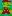

# `from-ascii`

This converts ASCII art to an image. Still a work-in-progress, search for `TODO` to see all that's left to be done.

Note that this does *not* act similarly to taking a screenshot. If you need behavior like that, check out
[textimg][textimg]. Instead, this treats characters in ASCII art as *pixels.*

## How it works

When a character is encountered, it is treated like a pixel. Most characters have 100%
opacity, but a few have special cases:

|  character  | opacity |
| :---------: | :-----: |
| ` ` (space) |   0%    |
|     `'`     |   25%   |
|     `"`     |   25%   |
|     `:`     |   50%   |
|     `;`     |   50%   |

Contributions are welcome for adding opacity values for more characters.

The generated image by default has a black background, with the assumption that the
ASCII art is intended to be rendered on a dark-themed terminal. This is configurable
via the CLI.

Pixels can be assigned colors using ANSI escape codes (e.g.
`"\033[31mRed text\033[0m"`).

Since each character in the ASCII art is treated like a pixel, and ASCII characters are
typically taller than they are wide, the image may appear "squashed" vertically. Rather
than have an opinion about the proper height of an image, it's left up to the user to
resize it in the way that works best for them.

## Examples

Check out the [examples] to see the input ASCII art.

[examples]: ./_examples/
[textimg]: https://github.com/jiro4989/textimg
